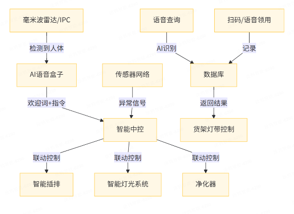

[English](./README.md) | 简体中文

# your_chat_bot

[your_chat_bot](https://github.com/tuya/TuyaOpen/tree/master/apps/tuya.ai/your_chat_bot) 是基于 tuya.ai 开源的大模型智能聊天机器人。通过麦克风采集语音，语音识别，实现对话、互动、调侃，还能通过屏幕或网页界面查看实时聊天内容。系统能够通过语音控制家庭中的智能设备，支持连接蓝牙音箱，通过蓝牙音箱对话聊天、查天气等。

**注意：TUYA AI V1.0 和 V2.0 版本切换需要先在 APP 上移除设备并清除数据后再使用。**
## 总体设计框架图


## 支持功能

### 核心功能
1. **AI 智能对话** - 基于大语言模型的自然语言对话
2. **语音控制智能设备** - 通过语音指令控制家庭中的智能设备
3. **蓝牙音箱支持** - 支持连接蓝牙音箱进行音频输出，通过蓝牙音箱对话聊天、查天气等
4. **多种唤醒方式** - 按键唤醒 / 语音唤醒，回合制对话
5. **语音打断** - 支持语音打断 AI 回复（需硬件支持）
6. **表情显示** - 对话过程中的表情符号反馈

### 显示与界面
7. **网页聊天界面** - 通过浏览器访问 `http://<设备IP>:8080` 查看聊天记录
8. **文字聊天** - 通过网页界面发送文字消息给 AI
9. **APP 集成** - 支持 APP 端实时查看聊天内容

### 连接与配网
10. **蓝牙配网** - 蓝牙快捷连接路由器
11. **AI 角色切换** - APP 端实时切换 AI 智能体角色


## 网页聊天界面

内置 Web 服务器提供现代化的聊天界面，可通过浏览器访问：

- **访问地址**: `http://<设备IP>:8080`
- **功能特性**:
  - 实时消息显示，支持流式文本
  - 文字输入框，可发送消息给 AI
  - AI 连接状态指示器
  - 移动端友好的响应式设计
  - URL 自动转换为可点击链接
  - 支持图片显示

### 网页界面示意图
```
┌─────────────────────────────────────┐
│         智能焊台聊天记录              │
│          From Tuya Open              │
├─────────────────────────────────────┤
│  [用户消息]                          │
│                      [AI 回复]       │
├─────────────────────────────────────┤
│ [输入消息...]              [发送]    │
├─────────────────────────────────────┤
│ 🟢 AI已连接           共X条消息      │
└─────────────────────────────────────┘
```

## 依赖硬件能力

1. 音频采集（麦克风）
2. 音频播放（扬声器或蓝牙音箱）
3. 网络连接（WiFi/以太网）
4. 树莓派开发板

## 已支持硬件

| 型号 | 配置文件 | 说明 |
| --- | --- | --- |
| 树莓派 | app_default.config | Raspberry Pi OS + ALSA 音频支持 |

## 树莓派使用指南

### 环境要求
- Raspberry Pi OS
- ALSA 音频支持（麦克风 + 扬声器/蓝牙音箱）
- 网络连接（WiFi/以太网）

### 编译与运行
```bash
# 进入项目目录
cd apps/tuya.ai/your_chat_bot

# 编译
tos build

# 运行
cd dist/your_chat_bot_1.0.1
./your_chat_bot_QIO_1.0.1.bin
```

### 键盘控制（树莓派）
| 按键 | 功能 |
| --- | --- |
| `S` | 开始/发送 - 开始录音或发送当前录音给 AI |
| `X` | 停止 - 结束对话会话 |
| `V` | 音量增加 |
| `D` | 音量减小 |
| `Q` | 退出程序 |

## 编译

1. 运行 `tos config_choice` 命令，选择树莓派配置。
2. 如需修改配置，请先运行 `tos menuconfig` 命令修改配置。
3. 运行 `tos build` 命令，编译工程。

## 配置说明

### 默认配置
- VAD 触发对话模式（按 S 开始，自动语音检测）

### 对话模式

| 模式 | 宏定义 | 说明 |
| --- | --- | --- |
| 长按对话 | `ENABLE_CHAT_MODE_KEY_PRESS_HOLD_SINGEL` | 按住按键说话，说完松开 |
| VAD 触发 | `ENABLE_CHAT_MODE_KEY_TRIG_VAD_FREE` | 按一下进入/退出聆听状态，开启 VAD 检测 |
| 唤醒单轮 | `ENABLE_CHAT_MODE_ASR_WAKEUP_SINGEL` | 唤醒词唤醒后进行单轮对话 |
| 唤醒自由 | `ENABLE_CHAT_MODE_ASR_WAKEUP_FREE` | 唤醒词唤醒后自由对话（30秒超时） |

### AEC 回声消除

| 宏定义 | 说明 |
| --- | --- |
| `ENABLE_AEC` | 根据硬件是否支持回声消除来配置。支持 AEC 才能使用语音打断功能。 |

## Web 服务器 API

| 端点 | 方法 | 说明 |
| --- | --- | --- |
| `/` | GET | 主聊天界面 HTML 页面 |
| `/api/chat` | GET | 获取聊天记录 JSON |
| `/api/send` | POST | 发送文字消息给 AI |
| `/api/status` | GET | 检查 AI 连接状态 |

### 发送消息示例
```bash
# 发送文字消息
curl -X POST http://<设备IP>:8080/api/send \
  -H "Content-Type: application/json" \
  -d '{"message": "你好，请介绍一下你自己"}'
```

## 项目结构

```
your_chat_bot/
├── src/
│   ├── app_chat_bot.c      # 主聊天机器人逻辑
│   ├── app_chat_history.c  # 聊天记录管理
│   ├── app_web_server.c    # Web 服务器
│   ├── display/            # LCD 显示相关
│   └── media/              # 音频资源
├── include/
│   ├── app_chat_history.h
│   └── app_web_server.h
├── config/                 # 硬件配置文件
├── app_default.config      # 默认配置
├── README.md               # 英文文档
└── RAEDME_zh.md           # 中文文档
```

## 许可证

本项目基于 Tuya Open 许可证开源。详见 LICENSE 文件。
