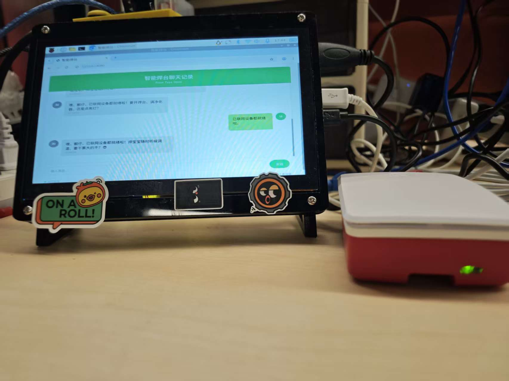

English | [简体中文](./RAEDME_zh.md)

# your_chat_bot

[your_chat_bot](https://github.com/tuya/TuyaOpen/tree/master/apps/tuya.ai/your_chat_bot) is an open-source large model intelligent chatbot based on tuya.ai. It collects voice through a microphone, performs speech recognition, and enables conversation, interaction, and banter. You can also see real-time chat content on the screen or through a web interface. The system can control smart home devices through voice commands, supports connecting to Bluetooth speakers for audio output, enabling voice conversations, weather queries, and more through Bluetooth speakers.

**Note: Switching between TUYA AI V1.0 and V2.0 requires removing the device and clearing the data on the APP before use.**

## Supported Features

### Core Features
1. **AI Intelligent Conversation** - Natural language dialogue powered by large language models
2. **Voice Control Smart Devices** - Control smart home devices through voice commands
3. **Bluetooth Speaker Support** - Connect to Bluetooth speakers for audio output, enabling voice conversations, weather queries, and more
4. **Multiple Wake-up Modes** - Button wake-up / Voice wake-up with turn-based dialogue
5. **Voice Interruption** - Interrupt AI responses with voice (hardware support required)
6. **Expression Display** - Emoji and expression feedback during conversation

### Display & Interface
7. **Web Chat Interface** - Browser-based chat history viewing at `http://<device-ip>:8080`
8. **Text Chat** - Send text messages to AI through the web interface
9. **APP Integration** - Real-time chat content viewing on mobile app

### Connectivity
10. **Bluetooth Network Config** - Quick Bluetooth connection to router
11. **AI Role Switching** - Real-time switching of AI entity roles via APP


## Web Chat Interface

The built-in web server provides a modern chat interface accessible via browser:

- **URL**: `http://<device-ip>:8080`
- **Features**:
  - Real-time message display with streaming text
  - Text input for sending messages to AI
  - AI connection status indicator
  - Mobile-friendly responsive design
  - URL auto-linking in messages
  - Image display support

### Web Interface Screenshot
```
┌─────────────────────────────────────┐
│         智能焊台聊天记录              │
│          From Tuya Open              │
├─────────────────────────────────────┤
│  [User Message]                     │
│                    [AI Response]    │
├─────────────────────────────────────┤
│ [Input box...]           [Send]     │
├─────────────────────────────────────┤
│ 🟢 AI Connected      X messages     │
└─────────────────────────────────────┘
```

## Hardware Dependencies

1. Audio capture (microphone)
2. Audio playback (speaker or Bluetooth speaker)
3. Network connectivity (WiFi/Ethernet)
4. Raspberry Pi board

## Supported Hardware

| Model | Config | Description |
| --- | --- | --- |
| Raspberry Pi | app_default.config | Raspberry Pi OS with ALSA audio support |

## Raspberry Pi Setup

### Requirements
- Raspberry Pi OS
- ALSA audio support (microphone + speaker/Bluetooth speaker)
- Network connectivity (WiFi/Ethernet)

### Build & Run
```bash
# Enter project directory
cd apps/tuya.ai/your_chat_bot

# Build
tos build

# Run
cd dist/your_chat_bot_1.0.1
./your_chat_bot_QIO_1.0.1.bin
```

### Keyboard Controls (Raspberry Pi)
| Key | Function |
| --- | --- |
| `S` | Start/Send - Start listening or send current recording to AI |
| `X` | Stop - End conversation session |
| `V` | Volume Up |
| `D` | Volume Down |
| `Q` | Quit application |

## Compilation

1. Run `tos config_choice` to select Raspberry Pi configuration.
2. Run `tos menuconfig` to modify configuration if needed.
3. Run `tos build` to compile the project.

## Configuration

### Default Configuration
- VAD-triggered conversation mode (press S to start, automatic speech detection)

### Conversation Modes

| Mode | Macro | Description |
| --- | --- | --- |
| Hold to Talk | `ENABLE_CHAT_MODE_KEY_PRESS_HOLD_SINGEL` | Hold button while speaking, release when done |
| VAD Trigger | `ENABLE_CHAT_MODE_KEY_TRIG_VAD_FREE` | Press once to enter/exit listening state with VAD detection |
| Voice Wake Single | `ENABLE_CHAT_MODE_ASR_WAKEUP_SINGEL` | Wake with keyword for single-round conversation |
| Voice Wake Free | `ENABLE_CHAT_MODE_ASR_WAKEUP_FREE` | Wake with keyword for continuous conversation (30s timeout) |

### AEC Support

| Macro | Description |
| --- | --- |
| `ENABLE_AEC` | Enable if hardware supports echo cancellation. Required for voice interruption feature. |

## Web Server API

| Endpoint | Method | Description |
| --- | --- | --- |
| `/` | GET | Main chat interface HTML page |
| `/api/chat` | GET | Get chat history as JSON |
| `/api/send` | POST | Send text message to AI |
| `/api/status` | GET | Check AI connection status |

### Send Message Example
```bash
# Send text message
curl -X POST http://<device-ip>:8080/api/send \
  -H "Content-Type: application/json" \
  -d '{"message": "Hello, please introduce yourself"}'
```

## Project Structure

```
your_chat_bot/
├── src/
│   ├── app_chat_bot.c      # Main chatbot logic
│   ├── app_chat_history.c  # Chat history management
│   ├── app_web_server.c    # Web server
│   ├── display/            # LCD display related
│   └── media/              # Audio resources
├── include/
│   ├── app_chat_history.h
│   └── app_web_server.h
├── config/                 # Hardware configuration files
├── app_default.config      # Default configuration
├── README.md               # English documentation
└── RAEDME_zh.md           # Chinese documentation
```

## License

This project is open source under the Tuya Open License. See the LICENSE file for details.
